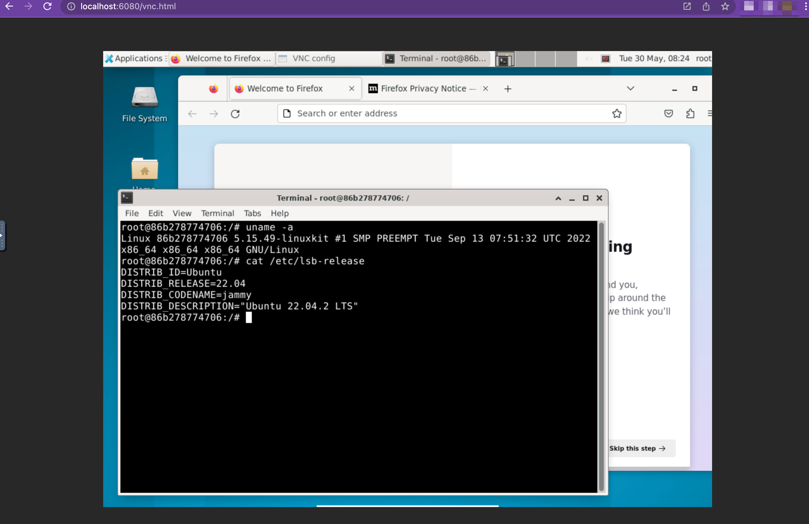

# docker-ubuntu-desktop
Ubuntu Desktop Web Browser Accessible Docker Image

## ScreenShot


## Usage
```
$ docker run -it --platform=linux/amd64 -p 7860:7860 iilemoz/docker-ubuntu-desktop-vnc
```

## Access
```
http://localhost:7860/vnc.html
```

or

```
https://localhost:7860/vnc.html
```


## Docker Pull
```
$ docker pull iilemoz/docker-ubuntu-desktop-vnc
```

## Docker Build
```
$ docker build . -t docker-ubuntu-desktop-vnc
```

## License
MIT License (c) 2023 [Takahashi Akari](https://github.com/iilemoz)
